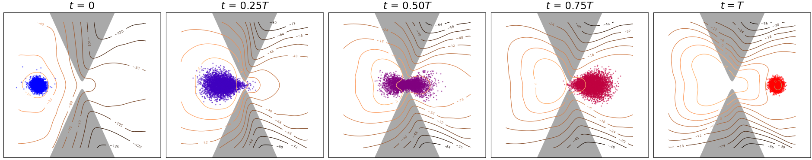
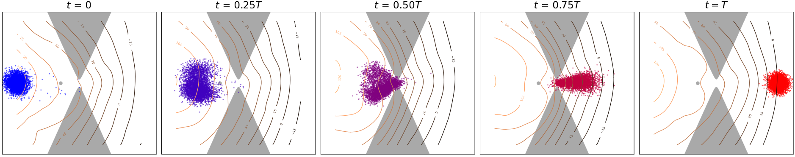
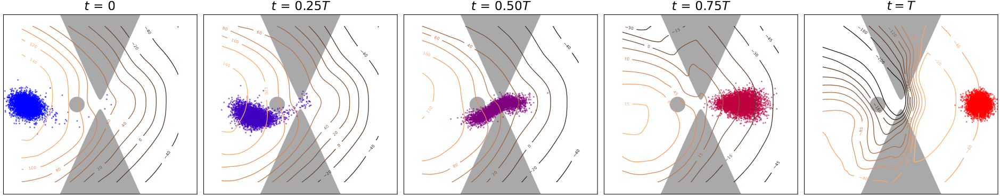
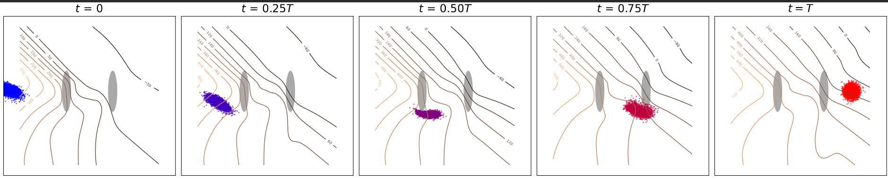
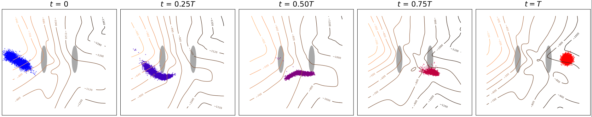
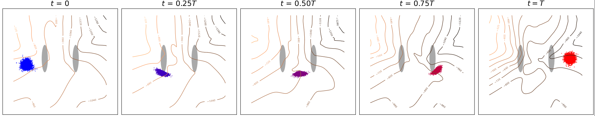

# Likelihood training of Schrödinger bridge using Forward-backward SDEs theory

[](https://github.com/gwatkinson/mva_snlp_canine/actions/workflows/main.yml)
[](https://github.com/gwatkinson/mva_snlp_canine/actions/workflows/quality.yml)
[](https://github.com/psf/black)

This is the repository associated with the project for the MVA course __Generative Modelling__.

This is a group project realised by :

* Benjamin Maurel
* Jérémie Stym-Popper
* Gabriel Watkinson

Don't hesitate to contact any of us if you have any questions.

This experiments presented here and in the report comes from modification of https://github.com/ghliu/DeepGSB.

## Installation

1. Clone the repository.
```bash
git clone https://github.com/gwatkinson/mva_sb_generative
```

2. Install the project and dependencies, creating a virtual environment with conda
```bash
cd mva_sb_generative
conda env create --file requirements.yaml
conda activate deepgsb
```


## Reproduce the experiments

To reproduce the experiments, you can run the following commands:

```bash
cd DeepGSB
bash run.sh Evac
```

## Results

The report can be found in the root of the repo in [report.pdf](https://github.com/gwatkinson/mva_sb_generative/blob/main/report.pdf).

The slides of the presentation are also available in the root of the repo in [presentation.pdf](https://github.com/gwatkinson/mva_sb_generative/blob/main/slides.pdf)

Lastly, some images of our experiments can be found in the [images folder](https://github.com/gwatkinson/mva_sb_generative/blob/main/images/).




Those images show the impact of an obstacle in front of a door, simulating an evacuation or a crowd movement.





## Credits

```latex
@inproceedings{liu2022deep,
  title={Deep Generalized Schr{\"o}dinger Bridge},
  author={Liu, Guan-Horng and Chen, Tianrong and So, Oswin and Theodorou, Evangelos A},
  booktitle={Advances in Neural Information Processing Systems},
  year={2022}
}

@inproceedings{chen2022likelihood,
  title={Likelihood Training of Schr{\"o}dinger Bridge using Forward-Backward SDEs Theory},
  author={Chen, Tianrong and Liu, Guan-Horng and Theodorou, Evangelos A},
  booktitle={International Conference on Learning Representations},
  year={2022}
}
```
